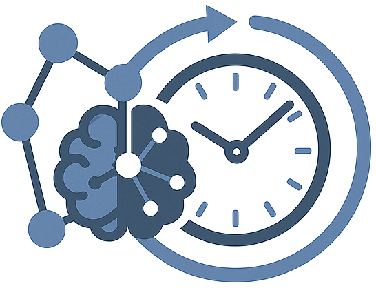
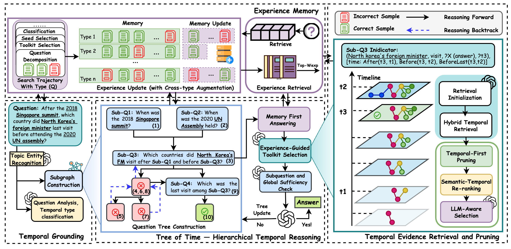

<p align="center">
  
</p>


# MemoTime: Memory-Augmented Temporal Knowledge Graph Enhanced Large Language Model Reasoning [WWW 2026]


<p align="center">
  <!-- Project homepage -->
  
<a href="https://stevetantan.github.io/MemoTime/" target="_blank">
  
  
</a>


  <!-- arXiv -->
  <a href="https://arxiv.org/abs/2510.13614" target="_blank">
    
  </a>


  <!-- Stars -->
  <a href="https://github.com/SteveTANTAN/MemoTime/stargazers" target="_blank">
    
  </a>


</p>

## News!
Our paper has been accepted for publication at WWW 2026! 

## How to cite
If you are interested or inspired by this work, you can cite us by:
```sh
@inproceedings{tan2026memotime,
  title={Memotime: Memory-augmented temporal knowledge graph enhanced large language model reasoning},
  author={Tan, Xingyu and Wang, Xiaoyang and Liu, Qing and Xu, Xiwei and Yuan, Xin and Zhu, Liming and Zhang, Wenjie},
  booktitle = {Proceedings of the ACM Web Conference 2026},
  pages = {4220–4231},
  year={2026}
}
```

---

## 📄 Abstract

Large Language Models exhibit strong reasoning abilities but often fail to maintain **temporal consistency** when questions involve multiple entities, compound operators, and evolving event sequences.

<p align="center">
  
</p>


**MemoTime** addresses four key challenges:
(1) maintaining temporal faithfulness in multi-hop reasoning,
(2) synchronizing multiple entities along shared timelines,
(3) adapting retrieval to diverse temporal operators, and
(4) reusing prior reasoning experience for efficiency and stability.
MemoTime decomposes complex temporal questions into a hierarchical **Tree of Time**, enabling operator-aware reasoning with dynamic evidence retrieval and a self-evolving experience memory for continual improvement.


---

## 📦 Project Structure

```
MemoTime/
├── memotime/                       # Main source code
│   ├── run.py                      # CLI interface
│   ├── main.py                     # Experiment runner
│   ├── config.py                   # Configuration management
│   ├── data_process.py             # Dataset handling
│   ├── experiment_database.py      # Experiment tracking
│   └── kg_agent/                   # Core reasoning engine
│       ├── agent.py                # Main reasoning agent
│       ├── stepwise.py             # Recursive decomposition logic
│       ├── decompose.py            # Question decomposition
│       ├── hybrid_retrieval.py     # Hybrid retrieval strategies
│       ├── unified_knowledge_store.py  # Experience memory
│       ├── answer_verifier.py      # Answer verification
│       ├── prompts.py              # General prompts
│       ├── fixed_prompts.py        # Toolkit initialization prompts
│       ├── llm.py                  # LLM interface
│       └── ...                     # Other components
├── Data/                           # Dataset directory
│   ├── prepare_datasets.py         # Dataset preparation script
│   ├── TimeQuestions/              # TimeQuestions dataset
│   └── MultiTQ/                    # MultiTQ dataset

```

---

## 🚀 Quick Start

### 1. Installation

```bash
git clone <URL>
cd WWW-MemoTime-Submit

# install requirements
bash setup_dependencies.sh

# Install verification
python verify_installation.py

```

### 2. Configure API Keys

Edit the following lines in `memotime/kg_agent/llm.py`:

```python
DEFAULT_OPENAI_API_KEY = "your-openai-api-key"
```

### 3. Prepare Datasets
The process including whole graph constrcution, graph indexing, hybird indexing, and topic entity recognization. You can choose how many question you want for entity recognization by flag "-n".

```bash
cd Data
# Prepare for all datasets
python prepare_datasets.py --dataset all --build-hybrid --build-embeddings

# Prepare for MultiTQ
python prepare_datasets.py --dataset MultiTQ --build-hybrid --build-embeddings

# Process only 10 questions for MultiTQ
python prepare_datasets.py --dataset TimeQuestions -n 20

# If you already have DB and index, just generate candidates for 20 questions
python prepare_datasets.py --dataset TimeQuestions -n 20 --skip-db --skip-index

```

---

##  💻 Usage

### Basic Commands

```bash
cd ../memotime
# Run experiments
python run.py --questions 5 --dataset MultiTQ

# Run with detailed configuration
python run.py --retries 2 --depth 3 --hybrid --unified-knowledge --dataset MultiTQ --questions 50

# Run by question type
python run.py --dataset MultiTQ --type equal --questions 20
```

### View Help and Results

```bash
# Show all available options
python run.py --help
```

**Parameter categories:**

* **Experiment configuration:** `--dataset`, `--name`, `--desc`, `--tags`
* **Feature flags:** `--hybrid`, `--unified-knowledge`
* **Storage mode:** `--storage-mode`, `--enable-shared-fallback`, `--config-name`
* **Experiment range:** `--questions`, `--skip`, `--type`, `--entities`
* **LLM configuration:** `--model`
* **Miscellaneous:** `--result`, `--no-save`, `--verbose`

```bash
# View experiment results
python run.py --result --name my_experiment
python run.py --result --preset accuracy_mode
```

**Result view includes:**

* Configuration summary and run history
* Success rate by overall and question type
* Answer type and temporal granularity statistics

---

## 📄 License

Released under the **MIT License**. See [LICENSE](LICENSE) for details.

